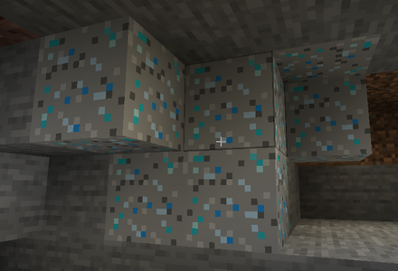
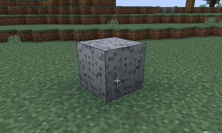
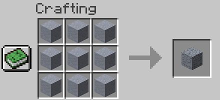
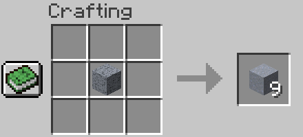

ClayOre
---

This mod introduces some ores generated world, blocks and recipes related clay respectively.

Blocks
---

- Clay Ore  
  
You can mine by any pickaxes, and the ore drops some clays. It will be generated shallow depth underground.

- Dense Clay Ore  
  
You can mine by any pickaxes. The ore drops more clay, and ore is generated deep underground.

- Compressed Clay  
  
You can compress the clay to this block in order to carry the clay more. Of course, you can also craft it back into the clay.

Recipe
---

- Clay to Clay ball  

- Clay to Compressed Clay  

- Compressed Clay to Clay  

Latest Release
-----
v0.6.0

Minecraft Version(s)
-----
- v1.16.1 (WIP)
- v1.15.2

Licenses
---

- images (./images/*)
[Mojang Studio](https://account.mojang.com/documents/minecraft_eula)

- source codes (others)
[MIT License](./LICENSE)
